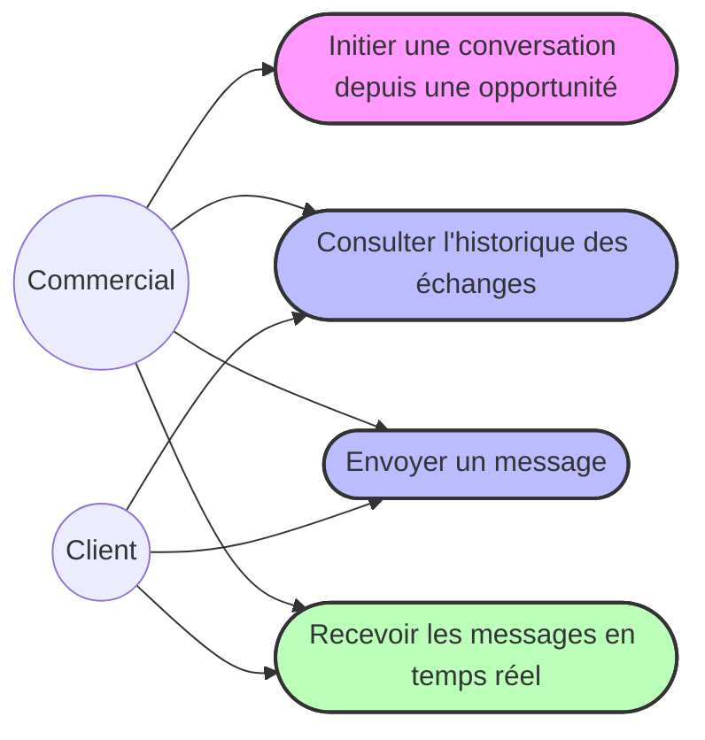
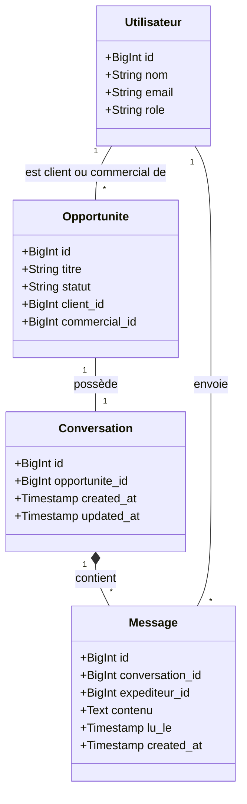
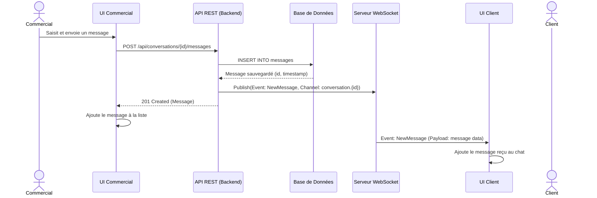

# Conception du Module de Chat Opportunité

Ce document présente la conception technique et fonctionnelle du module de messagerie intégré à la gestion des opportunités.

## 1. 📐 Diagrammes UML

### Diagramme des Cas d'Utilisation
Ce diagramme illustre les interactions possibles entre les deux acteurs (Commercial et Client) et le système de messagerie.

### Diagramme de Classes
Ce diagramme représente les entités principales et leurs relations.

### Diagramme de Séquence (Envoi et réception de message)

---

## 2. 🗄️ Modèle de Données

Les données seront stockées dans une base relationnelle. L'architecture respecte la contrainte "Une opportunité = une conversation".

### Table `conversations`
| Colonne | Type | Description |
|---|---|---|
| `id` | `BIGINT (PK)` | Identifiant unique de la conversation. |
| `opportunite_id` | `BIGINT (FK)` | Clé étrangère vers la table `opportunites`. Doit être `UNIQUE` pour garantir 1 conversation max par opportunité. |
| `created_at` | `TIMESTAMP` | Date de création. |
| `updated_at` | `TIMESTAMP` | Date de dernière mise à jour (utile pour trier les conversations actives). |

### Table `messages`
| Colonne | Type | Description |
|---|---|---|
| `id` | `BIGINT (PK)` | Identifiant unique du message. |
| `conversation_id` | `BIGINT (FK)` | Clé étrangère vers la table `conversations`. |
| `expediteur_id` | `BIGINT (FK)` | Clé étrangère vers la table `users` (l'auteur). |
| `contenu` | `TEXT` | Le contenu texte du message. |
| `lu_le` | `TIMESTAMP` | Horodatage de la lecture par le destinataire (nullable). |
| `created_at` | `TIMESTAMP` | Date d'envoi du message. |
| `updated_at` | `TIMESTAMP` | Date de modification (si édition autorisée plus tard). |

---

## 3. 🔌 Architecture Technique

Puisque le projet actuel est basé sur **Laravel**, voici l'architecture recommandée pour ce stack, avec des alternatives mentionnées.

### Backend
- **Framework :** Laravel (PHP) ou Node.js (Express/NestJS) / Spring Boot.
- **Base de données :** MySQL / PostgreSQL. L'ORM (Eloquent) gérera les relations (`hasOne`, `belongsTo`, `hasMany`).

### Temps Réel (WebSockets)
- **Solution recommandée (Laravel) :** **Laravel Reverb** (nouveau serveur WebSocket natif de Laravel) ou **Pusher**.
- **Alternative :** Serveur Node.js avec **Socket.io**.
- **Fonctionnement :** 
  - Les clients souscrivent à un *Private Channel* nommé `conversation.{opportunite_id}`.
  - Lorsqu'un message est créé via l'API, le backend diffuse un événement `MessageSent`.

### API REST
Endpoints nécessaires pour le fonctionnement du module :

1. **`GET /api/opportunites/{id}/conversation`**
   - Rôle : Récupérer la conversation liée. Si elle n'existe pas encore (et que l'utilisateur a les droits de l'initialiser, ex: le commercial), l'API la crée à la volée et la retourne.
2. **`GET /api/conversations/{id}/messages?page=1`**
   - Rôle : Charger l'historique des messages avec pagination (ex: 20 messages par page).
3. **`POST /api/conversations/{id}/messages`**
   - Rôle : Ajouter un nouveau message à la conversation.
   - Body : `{ "contenu": "Bonjour, concernant ce devis..." }`

---

## 4. 🖥️ Description de l'Interface Utilisateur (UX/UI)

### Vue Chat (Intégrée au Dashboard)
L'interface sera une fenêtre de chat (widget latéral ou onglet intégré dans la vue de détail de l'opportunité) commune dans sa structure pour le Commercial et le Client.

- **En-tête (Header) :** 
  - Titre de l'opportunité.
  - Statut de l'opportunité (ex: "En négociation", pastille de couleur).
  - Nom de l'interlocuteur (Client pour le commercial, Commercial pour le client).
- **Zone de messages (Scrollable) :**
  - Messages alignés à **droite** (fond coloré, ex: bleu) pour les messages envoyés par l'utilisateur courant.
  - Messages alignés à **gauche** (fond gris/neutre) pour les messages reçus de l'interlocuteur.
  - Horodatage discret sous chaque bulle (ex: "14:32").
  - Indicateur de lecture (double coche ✔✔).
  - *Comportement UX :* Auto-scroll vers le bas lors du chargement initial et lors de la réception d'un nouveau message. Infinite scroll vers le haut pour charger l'historique.
- **Zone de saisie (Footer) :**
  - Champ texte (`<textarea>` auto-extensible).
  - Bouton "Envoyer" (icône avion en papier) activé uniquement si le champ n'est pas vide.
  - *Évolution prévue :* Icône trombone pour les futures pièces jointes.

---

## 5. 🔐 Règles de Sécurité

- **Authentification requise :** L'accès à l'API et au WebSocket nécessite un token ou une session valide (Sanctum / Session).
- **Autorisation stricte (Policies) :** 
  - **Lecture / Écriture :** Seuls l'utilisateur défini comme `client_id` et l'utilisateur défini comme `commercial_id` sur l'opportunité associée ont le droit d'accéder à la conversation et d'envoyer des messages.
  - **Canaux privés WebSocket :** L'authentification au channel `conversation.{id}` est vérifiée par le backend pour interdire les écoutes clandestines.
- **Validation des données :** Le contenu des messages doit être nettoyé (protection XSS) et sa longueur limitée (ex: 2000 caractères max).

---

## 6. 📌 Contraintes et Évolutivité

- **Pas de chat global :** L'interface de chat n'est accessible que depuis le contexte d'une opportunité spécifique. Il n'y a pas de liste globale de contacts à qui parler hors contexte.
- **Une opportunité = Une conversation :** Géré par une contrainte d'unicité en base de données sur la colonne `opportunite_id` de la table `conversations`.
- **Évolutions futures (Scalabilité) :**
  - La table `messages` est conçue pour supporter l'ajout futur d'une table polymorphique `attachments` pour les fichiers joints.
  - L'architecture événementielle (WebSockets) permettra d'ajouter facilement des **notifications push** ou des **emails de rappel** si un message reste non lu pendant X heures.
